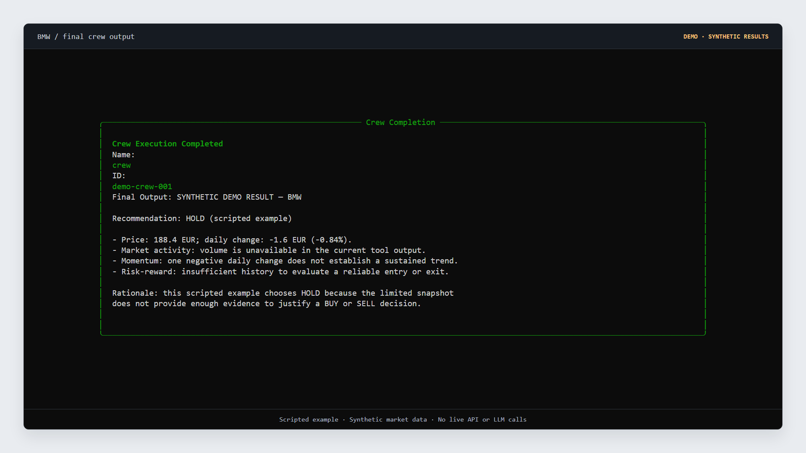
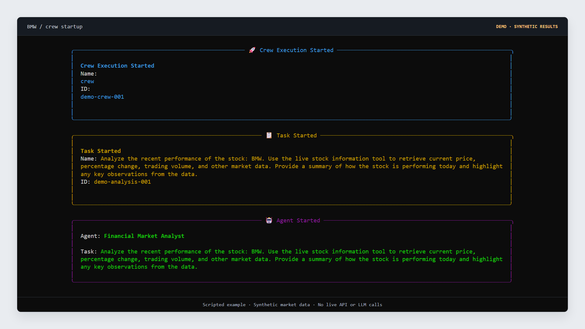
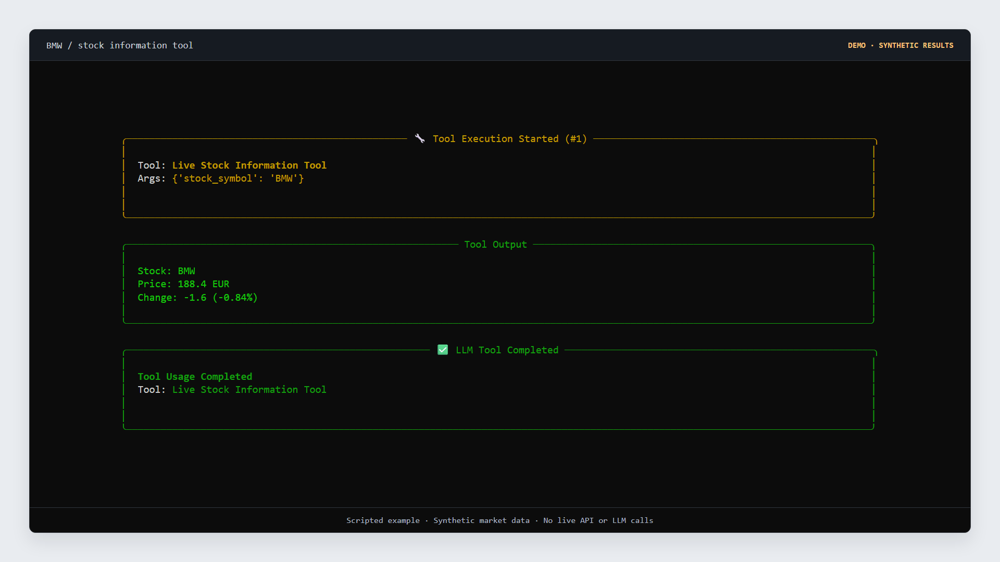
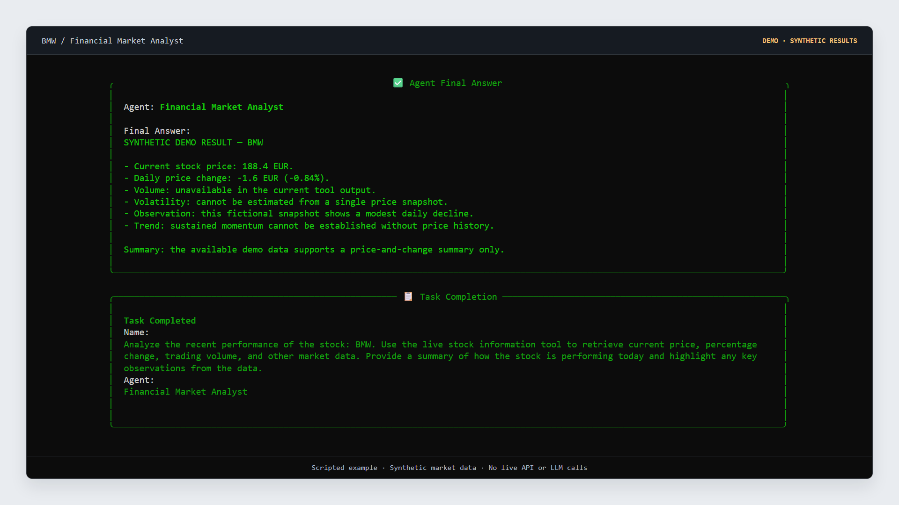
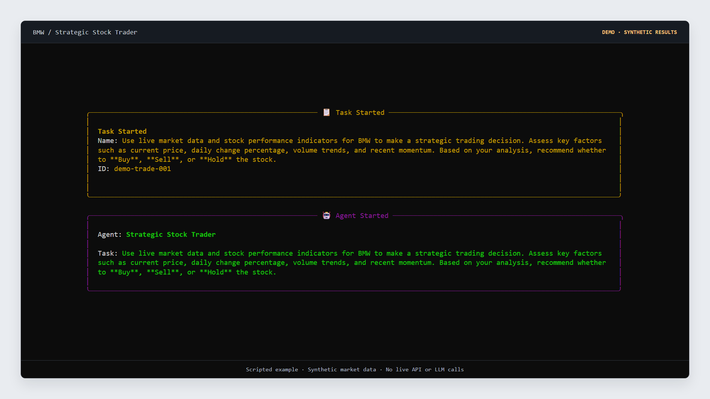
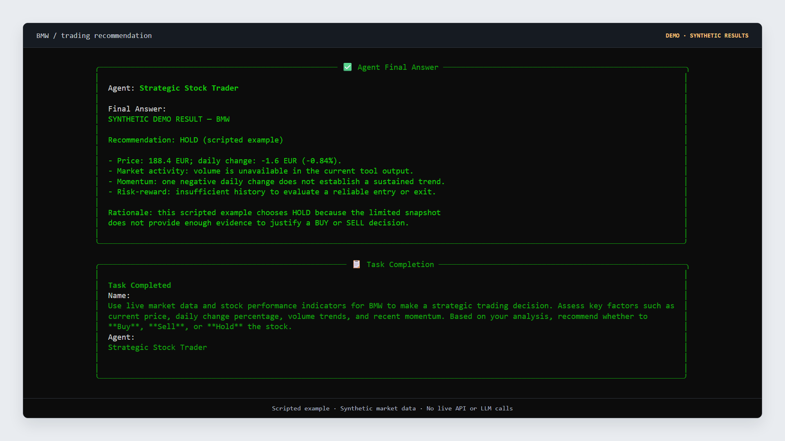
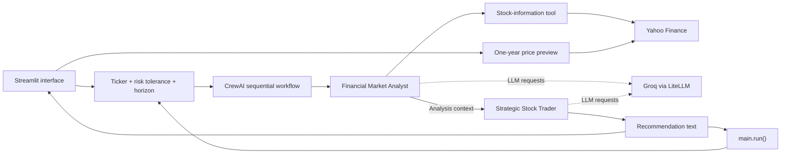

# 📈 AI Multi-Agent Stock Analysis & Trading System

A Python application that uses two CrewAI agents to turn a Yahoo Finance stock snapshot into an analysis summary and a Buy, Sell, or Hold recommendation. A Streamlit interface provides ticker selection, risk-profile inputs, a price-history preview, and a downloadable text report; a Python entrypoint runs the same crew from the terminal.

**Python · CrewAI · Groq / LiteLLM · yfinance · Streamlit**

The project implements a compact agent workflow with prototype-level runtime and output handling. Recommendations are generated text; the application does not submit trades or manage a brokerage account.

## Contents

- [🔎 Overview](#overview)
- [📸 Project Showcase](#project-showcase)
- [🤖 Architecture and Workflow](#architecture-and-workflow)
- [🛠️ Technology Stack](#technology-stack)
- [📁 Project Structure](#project-structure)
- [🚀 Getting Started](#getting-started)
- [⚙️ Configuration](#configuration)
- [▶️ Running the Application](#running-the-application)
- [📝 Engineering Notes and Limitations](#engineering-notes-and-limitations)
- [🤝 Development and Contributions](#development-and-contributions)
- [📚 References](#references)

## Overview

The system separates market-data access, analysis, and recommendation generation into small modules with distinct responsibilities.

| Capability | Implementation |
| --- | --- |
| Market snapshot | A custom CrewAI tool reads price, currency, daily change, and percentage change through `yfinance`. |
| Analysis | The Financial Market Analyst has access to the stock-information tool and produces a text summary. |
| Recommendation | The Strategic Stock Trader evaluates the preceding task's context and produces a Buy, Sell, or Hold recommendation with a rationale. |
| Profile inputs | Risk tolerance and investment horizon are interpolated into both task descriptions. |
| Browser interface | Streamlit shows a one-year closing-price chart, analysis status, final text, captured debug logs, and a report-download button. |
| Terminal entrypoint | `main.run()` accepts a ticker and optional profile arguments, then prints the crew result. |

The stock-information tool currently returns **price and change only**. Volume, volatility, fundamentals, news sentiment, and computed technical indicators are not supplied by that tool. The browser's historical chart is a separate preview; its data is not passed into the agents.

## Project Showcase

**📸 These console examples use synthetic BMW data and scripted agent responses.** They illustrate the output format and workflow; they are not evidence of a successful live model run. Each demo image includes a visible label. The repository also contains a Streamlit frontend, which is not pictured in these captures.

### 🏁 Final result



*Final-output example: a fictional price snapshot and a scripted HOLD rationale. The missing volume and price-history inputs remain explicit.*

### 🚀 Crew execution output



*Demo console output showing the crew and analyst starting the BMW analysis task. This is a scripted startup display.*

### 💹 Stock snapshot result



*The existing research function was evaluated against a local fixture: 188.4 EUR, down 1.6 EUR (-0.84%). No Yahoo Finance request was made for this example.*

### 🔎 Analyst summary



*Illustrative analyst output distinguishes the available price snapshot from information the tool does not provide.*

### 🤖 Trader task output



*Demo console output showing the recommendation task handed to the Strategic Stock Trader. This is a scripted startup display.*

### 🎯 Trading recommendation



*Illustrative recommendation text and task-completion display. No live agent execution or order placement occurred.*

📚 The [capture guide](portfolio-images/README.md) identifies all 12 images and their provenance. The [demo fixture](portfolio-images/demo-results.json) contains the synthetic values and scripted responses.

## Architecture and Workflow



1. **Collect inputs.** The browser collects a ticker, risk tolerance, and investment horizon. The Python entrypoint accepts the same inputs with defaults.
2. **Start the crew.** `crew.py` lists the analyst and trader tasks in that order. It relies on CrewAI's default sequential process.
3. **Analyze the snapshot.** The analyst can call `Live Stock Information Tool`, which reads `yf.Ticker(symbol).info` and formats the selected fields as text.
4. **Generate a recommendation.** CrewAI supplies prior task output as context to the trader. The trader has no direct tools; it reasons over that context and its task instructions.
5. **Present the final output.** The terminal prints the crew result. Streamlit displays its text, exposes captured logs, and offers a `.txt` download. The UI does not display separate analyst and trader reports.

| Component | Responsibility |
| --- | --- |
| `streamlit_app.py` | UI, historical preview, background worker, result queues, session state, and report download. |
| `main.py` | Callable Python entrypoint and default terminal execution. |
| `crew.py` | Agent/task assembly, execution order, verbose output, and tracing configuration. |
| `agents/` | Agent roles, goals, backstories, LLM configuration, and tool access. |
| `tasks/` | Input interpolation, task instructions, and expected text outputs. |
| `tools/stock_research_tool.py` | Yahoo Finance lookup and price/change formatting. |

## Technology Stack

| Technology | Role |
| --- | --- |
| Python | Application and tool implementation; Python 3.11 is the baseline used for the local capture run. |
| CrewAI | Agents, task execution, tool registration, and sequential context propagation. |
| Groq + LiteLLM | Hosted inference for the configured `groq/llama-3.3-70b-versatile` model. |
| `yfinance` | Market-snapshot lookup and one-year history for the UI preview. |
| Streamlit | Browser interface, chart, status display, session state, and text download. |
| `python-dotenv` | Local environment-variable loading. |
| `threading`, `queue`, `io` | UI worker execution, result transfer, and console capture. |

`requirements.txt` also declares `crewai-tools` and `pandas`. The custom tool uses CrewAI's own decorator; `pandas` is imported by the frontend. Dependencies are currently unpinned, and there is no lockfile.

## Project Structure

```text
AI-Multi-Agent-Stock-Analysis-Trading-System/
├── README.md
├── .gitignore
├── .env.example
├── requirements.txt
├── streamlit_app.py
├── main.py
├── crew.py
├── agents/
│   ├── analyst_agent.py
│   └── trader_agent.py
├── tasks/
│   ├── analyse_task.py
│   └── trade_task.py
├── tools/
│   └── stock_research_tool.py
└── portfolio-images/
    ├── README.md
    ├── manifest.json
    ├── demo-results.json
    └── *.png
```

Create `.env` locally from the example. Virtual environments, credentials, and generated caches belong outside version control.

## Getting Started

### 1. Clone and create an environment

Use Python 3.11 for the setup below, Git, and a Groq API key with access to the configured model. Live runs require network access to Groq and Yahoo Finance.

```bash
git clone https://github.com/vinayak533/AI-Multi-Agent-Stock-Analysis-Trading-System.git
cd AI-Multi-Agent-Stock-Analysis-Trading-System
python -m venv .venv
```

Activate it on macOS or Linux:

```bash
source .venv/bin/activate
```

Or in Windows PowerShell:

```powershell
.\.venv\Scripts\Activate.ps1
```

### 2. Install dependencies

```bash
python -m pip install --upgrade pip
python -m pip install -r requirements.txt "crewai[litellm]"
```

The additional CrewAI extra installs the LiteLLM backend used for Groq; it is not explicitly included in the repository's requirements. See [CrewAI's Groq configuration guidance](https://docs.crewai.com/en/concepts/llms#groq).

### 3. Configure credentials

Copy `.env.example` to `.env` and replace the placeholder with your own key:

```dotenv
GROQ_API_KEY=your_groq_api_key
```

Use the [Groq console](https://console.groq.com/keys) to manage keys. Keep `.env` local; `.gitignore` excludes it.

## Configuration

| Setting | Current value / source |
| --- | --- |
| API credential | `GROQ_API_KEY` in the environment or local `.env`. |
| LLM model | `groq/llama-3.3-70b-versatile`, set in both agent modules. |
| Temperature | `0` for both agents; this reduces sampling variation but does not guarantee identical responses. |
| Task order | Analysis, then trading recommendation, as listed in `crew.py`. |
| Execution logging | `verbose=True` on the agents and crew. |
| Tracing | `tracing=True` in `crew.py`; provider/framework setup controls trace availability. |
| Default ticker | `BMW` for `python main.py`; `AAPL` in Streamlit. |
| Risk tolerance | UI values: `Low`, `Medium`, `High`; Python default: `Medium`. |
| Investment horizon | UI values: `Short-term`, `Medium-term`, `Long-term`; Python default: `Medium-term`. |

The model is configured in source, not through an `LLM_MODEL` environment variable. Risk tolerance and investment horizon guide the prompts; there is no numerical risk model or position-sizing engine.

During the local CLI capture, Groq returned `model_not_found` for the configured model. A successful live run was therefore not captured. Verify your account's model access against the [Groq model catalog](https://console.groq.com/docs/models); the synthetic screenshots do not verify that access.

## Running the Application

### Streamlit interface

```bash
python -m streamlit run streamlit_app.py
```

Open the local URL printed by Streamlit. Enter a Yahoo Finance ticker, choose a risk tolerance and investment horizon, and select **Start Analysis**. A completed run displays the final crew text, a recommendation badge, debug logs, and **Download Full Report**.

The price-history preview loads independently of the analysis request. Quote availability and timeliness depend on Yahoo Finance and the selected symbol.

### Terminal

```bash
python main.py
```

This runs the source-defined `BMW` example with `Medium` risk tolerance and a `Medium-term` horizon. Use a symbol recognized by Yahoo Finance; the entrypoint does not accept command-line ticker arguments.

### Python integration

```python
from dotenv import load_dotenv

load_dotenv()

from main import run

run("AAPL", risk_tolerance="Low", investment_horizon="Long-term")
```

`run()` prints the result and does not return it. Call `stock_crew.kickoff(inputs=...)` directly if your integration needs the `CrewOutput` object.

### Troubleshooting

| Symptom | Check |
| --- | --- |
| `model_not_found` or authentication error | Confirm the key and access to the model configured in both agent modules. |
| Missing LiteLLM backend | Install `"crewai[litellm]"` in the active environment. |
| Missing price or empty history | Check the exact Yahoo Finance symbol and service availability; the snapshot and chart use separate requests. |
| Interpreter or binary-import error | Recreate the virtual environment with one Python version instead of copying an environment from another machine. |
| UI waits without a result | Inspect the terminal and captured errors. The UI waits up to 300 seconds for its worker but does not cancel it on timeout. |

## Engineering Notes and Limitations

- **Role-specific tool access.** Only the analyst receives the market-data tool. The trader works from the analysis context, keeping data acquisition separate from the recommendation task.
- **Small, explicit modules.** Agents, task prompts, orchestration, and the tool are defined separately, making changes to each responsibility easy to inspect.
- **One crew behind two entrypoints.** The browser and Python entrypoint both call the same `stock_crew`; profile inputs are interpolated into the existing task descriptions.
- **Text-oriented contracts.** The tool returns a string and the tasks request prose. No structured action schema, confidence score, or recommendation validation is implemented. The UI badge uses keyword matching, which can misclassify text mentioning multiple actions.
- **Limited market evidence.** The tool has no historical-series, volume, sentiment, or fundamentals output. It reports a missing price as text; missing change fields or transport failures may still raise errors. The UI's separate chart does not extend the agent's inputs.
- **Prototype concurrency.** Streamlit runs the crew in a daemon thread, transfers results through queues, and captures output by replacing process-wide `sys.stdout`. The crew is shared, and the worker has no cancellation mechanism. This is not an isolated multi-user job service.

There is currently no automated test suite, CI workflow, backtesting harness, or deployment configuration in the repository. Pinning dependencies, validating structured outputs, expanding the data contract, and isolating worker state would be concrete next steps before a production deployment.

## Development and Contributions

Start with the [workflow](#architecture-and-workflow), then inspect the module relevant to your change. Keep new market fields in the tool layer, agent behavior in `agents/`, and output expectations in `tasks/`. Document any additional dependencies or configuration.

Run a syntax check from the repository root:

```bash
python -m compileall -q main.py crew.py streamlit_app.py agents tasks tools
```

This checks syntax only. For runtime changes, also exercise the affected entrypoint with valid provider access and record the ticker, model, dependency versions, and outcome. Live runs invoke external services and may incur inference costs.

Open an [issue](https://github.com/vinayak533/AI-Multi-Agent-Stock-Analysis-Trading-System/issues) for a reproducible problem or a focused proposal. Submit a pull request with the problem, changed behavior, and validation performed. Useful areas include missing-field handling, provider-failure handling, structured recommendations, and worker isolation. Keep credentials out of examples, logs, and commits; label any synthetic data or demo results clearly.

## References

- [CrewAI: LLM configuration](https://docs.crewai.com/en/concepts/llms)
- [CrewAI: execution processes](https://docs.crewai.com/en/concepts/processes)
- [Groq: LiteLLM integration](https://console.groq.com/docs/litellm)
- [yfinance source and documentation](https://github.com/ranaroussi/yfinance)
- [Streamlit documentation](https://docs.streamlit.io/)
