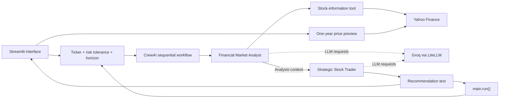

<div align="center">

<h1>AI Multi-Agent Stock Analysis &amp; Trading System</h1>

<p>For stock researchers: two CrewAI agents turn a Yahoo Finance snapshot into a risk-profile-aware Buy, Sell, or Hold rationale.</p>

<p>
  
  
  
  
  
</p>


<p><em>Synthetic output example: fictional price data and a scripted HOLD rationale; no live model run or trade execution.</em></p>

<p><a href="#demo-screenshots">Demo</a> | <a href="portfolio-images/README.md">Docs</a> | <a href="#architecture">Architecture</a> | <a href="#getting-started">Quickstart</a></p>

</div>

<details>
<summary>Table of contents</summary>

- [Problem and Solution](#problem-and-solution)
- [Key Features](#key-features)
- [Demo / Screenshots](#demo-screenshots)
- [Architecture](#architecture)
- [Tech Stack](#tech-stack)
- [Engineering Highlights](#engineering-highlights)
- [Getting Started](#getting-started)
- [Project Structure](#project-structure)
- [Roadmap](#roadmap)
- [Author](#author)
- [License and Acknowledgements](#license-and-acknowledgements)

</details>

<a id="problem-and-solution"></a>

## 🎯 Problem and Solution

Stock research involves gathering market data, interpreting it, and forming a recommendation for an investment profile.
This project separates those responsibilities: a Financial Market Analyst accesses a quote tool, then a Strategic Stock Trader uses the analysis context to produce a recommendation.

The Python entrypoint and documented Streamlit interface share one crew and the same profile inputs.
Runtime and output handling remain at prototype level; recommendations are text, with no order submission or brokerage-account management.

<a id="key-features"></a>

## ✨ Key Features

- **Quote lookup:** a custom CrewAI tool retrieves price, currency, daily change, and percentage change through `yfinance`, giving the analyst a defined market snapshot.
- **Sequential reasoning:** analysis precedes recommendation generation, so the trader receives the preceding task's context.
- **Role-specific tool access:** only the analyst can retrieve market data, keeping acquisition separate from the trader's recommendation task.
- **Profile-aware prompts:** ticker, risk tolerance, and investment horizon are interpolated into both task descriptions, tailoring the requested analysis and rationale.
- **Shared entrypoints:** `main.run()` prints the same crew's output used by the documented browser interface, keeping orchestration in one place.
- **Documented browser workflow:** ticker selection, a one-year closing-price preview, status, final text, debug logs, and a `.txt` download support reviewing a run.

**Snapshot boundary:** the tool supplies price and change only. It supplies no volume, volatility, fundamentals, news sentiment, or computed technical indicators. The browser's historical chart is a separate preview and is not passed to the agents.

**Capture boundary:** the console screenshots were prepared from an earlier CLI snapshot. The repository includes `streamlit_app.py`, risk-profile inputs, and the Streamlit and pandas dependencies; those UI features are not pictured.

<details>
<summary>Feature examples: snapshot and analyst output</summary>


*The research function was evaluated against a local fixture: 188.4 EUR, down 1.6 EUR (-0.84%). No Yahoo Finance request was made for this example.*


*Illustrative analyst output distinguishes available quote fields from market evidence the tool does not provide.*

</details>

<a id="demo-screenshots"></a>
<a id="project-showcase"></a>

## 📸 Demo / Screenshots

**The console examples use synthetic BMW data and scripted agent responses.** They illustrate output format and task handoff; they do not establish a successful live model run. Each demo image carries a visible label. The documented Streamlit frontend is not pictured.

<details open>
<summary>Console workflow gallery</summary>


*Scripted crew and analyst startup for the BMW analysis task.*


*Scripted handoff from analysis to the trader's recommendation task.*


*Illustrative HOLD rationale and task completion; no live agent execution or order placement occurred.*

</details>

The [capture guide](portfolio-images/README.md) indexes all 12 images and their provenance. The [demo fixture](portfolio-images/demo-results.json) records the synthetic values and scripted responses. Source captures 02 and 06 predate the profile inputs; the local capture used Python 3.11.15 and CrewAI 1.8.1.

<a id="architecture"></a>

## 🏗️ Architecture



Both the Streamlit interface and terminal entrypoint use the same sequential agent workflow.

- **Execution order:** `crew.py` lists analyst and trader tasks in that order, relying on CrewAI's default sequential process and prior-task context propagation.
- **Data boundary:** the analyst's `Live Stock Information Tool` reads `yf.Ticker(symbol).info` and formats selected fields as text; the trader has no direct tools.
- **Module boundaries:** agents own roles, goals, backstories, LLM configuration, and tool access; tasks own input interpolation, instructions, and expected outputs.
- **Shared orchestration:** both documented entrypoints call `stock_crew`; the terminal prints the crew result, while the browser displays final text rather than separate analyst and trader reports.
- **UI execution trade-off:** the documented frontend uses a background worker, queues, session state, and console capture. Its independent history request does not expand the agents' evidence.

<a id="tech-stack"></a>

## 🧰 Tech Stack

| Layer | Tool | Purpose and evidence |
| --- | --- | --- |
| Frontend | Streamlit, pandas | Chart, status, session state, and report download in `streamlit_app.py`. |
| Backend | Python | Application and custom tool; Python 3.11 was the local capture baseline. |
| Backend | `threading`, `queue`, `io` | Documented UI worker, result transfer, and console capture. |
| Backend | `python-dotenv` | Loads local environment variables; declared in `requirements.txt`. |
| AI-ML | CrewAI | Agent orchestration, tool registration, sequential tasks, and context propagation. |
| AI-ML | Groq via LiteLLM | Hosted inference for the source-configured `groq/llama-3.3-70b-versatile` model. |
| AI-ML | `crewai-tools` | Declared dependency; the custom stock tool uses CrewAI's own decorator. |
| Data | `yfinance` / Yahoo Finance | Quote lookup and the documented UI's separate one-year historical preview. |

Dependencies are unpinned and there is no lockfile. `requirements.txt` declares `crewai`, `crewai-tools`, `python-dotenv`, `yfinance`, `pandas`, and `streamlit`.

<a id="engineering-highlights"></a>

## ⚙️ Engineering Highlights

- **Agent responsibility:** acquisition and recommendation require different access. **Approach:** give the analyst the quote tool and pass its task output to a tool-free trader. **Result:** the documented workflow separates data retrieval from recommendation generation.
- **Entrypoint consistency:** browser and terminal inputs need the same orchestration. **Approach:** reuse `stock_crew` and interpolate profile inputs into the existing tasks. **Result:** both documented paths execute one agent/task definition.
- **Browser execution:** a crew run must deliver output to the UI. **Approach:** the documented frontend runs a daemon worker and transfers results through queues. **Limit:** the crew is shared, `sys.stdout` replacement is process-wide, and a 300-second wait does not cancel the worker; multi-user job isolation is not implemented.
- **Recommendation interpretation:** prose output needs a UI action label. **Approach:** tasks request text and the documented badge uses keyword matching. **Limit:** no structured action schema, confidence score, or recommendation validation exists; text mentioning multiple actions can be misclassified.
- **Incomplete market data:** quote fields may be unavailable. **Approach:** the tool reports a missing price as text, and demo outputs expose missing evidence. **Limit:** missing change fields and transport failures may raise errors; the separate UI chart supplies no historical input to the agents.

<a id="getting-started"></a>

## 🚀 Getting Started

Use Python 3.11, Git, and a Groq API key with access to the configured model. Live runs require network access to Groq and Yahoo Finance and may incur inference costs. The commands below are preserved from the original README.

### Install

```bash
git clone https://github.com/vinayak533/AI-Multi-Agent-Stock-Analysis-Trading-System.git
cd AI-Multi-Agent-Stock-Analysis-Trading-System
python -m venv .venv
```

Activate on macOS or Linux:

```bash
source .venv/bin/activate
```

Or in Windows PowerShell:

```powershell
.\.venv\Scripts\Activate.ps1
```

```bash
python -m pip install --upgrade pip
python -m pip install -r requirements.txt "crewai[litellm]"
```

The CrewAI extra installs the LiteLLM backend used for Groq; it is not explicitly included in `requirements.txt`. See [CrewAI's Groq configuration guidance](https://docs.crewai.com/en/concepts/llms#groq).

### Configure

Copy `.env.example` to a local `.env` and supply your own value for **`GROQ_API_KEY`**. This is the only documented credential variable. Manage keys in the [Groq console](https://console.groq.com/keys); `.gitignore` excludes `.env`.

| Setting | Documented value / source |
| --- | --- |
| Model | `groq/llama-3.3-70b-versatile`, set in both agent modules; no `LLM_MODEL` environment variable. |
| Temperature | `0` for both agents; reduces sampling variation without guaranteeing identical responses. |
| Task order | Analysis, then recommendation, as listed in `crew.py`. |
| Logging | `verbose=True` on agents and crew. |
| Tracing | `tracing=True` in `crew.py`; availability depends on provider/framework setup. |
| Default ticker | `BMW` for terminal execution; `AAPL` in the documented UI. |
| Risk tolerance | UI: `Low`, `Medium`, `High`; Python default: `Medium`. |
| Investment horizon | UI: `Short-term`, `Medium-term`, `Long-term`; Python default: `Medium-term`. |

Risk tolerance and horizon guide prompts; there is no numerical risk model or position-sizing engine.

**Recorded provider limitation:** Groq returned `model_not_found` during the local CLI capture, so no successful live run was captured. Check account access against the [Groq model catalog](https://console.groq.com/docs/models); the synthetic screenshots do not verify access.

### Run

Terminal:

```bash
python main.py
```

This executes the source-defined `BMW` example with `Medium` risk tolerance and a `Medium-term` horizon. Use a Yahoo Finance-recognized symbol; this entrypoint does not accept command-line ticker arguments.

Streamlit interface:

```bash
python -m streamlit run streamlit_app.py
```

Open Streamlit's printed URL, enter a ticker and profile, and select **Start Analysis**. Completion displays final crew text, a recommendation badge, debug logs, and **Download Full Report**.

The historical preview loads independently. Quote availability and timeliness depend on Yahoo Finance and the selected symbol.

Python integration:

```python
from dotenv import load_dotenv

load_dotenv()

from main import run

run("AAPL", risk_tolerance="Low", investment_horizon="Long-term")
```

`run()` prints the result and does not return it. Call `stock_crew.kickoff(inputs=...)` directly when an integration needs the `CrewOutput` object.

<details>
<summary>Troubleshooting</summary>

| Symptom | Check |
| --- | --- |
| `model_not_found` or authentication error | Confirm the key and model access for both agent modules. |
| Missing LiteLLM backend | Install `"crewai[litellm]"` in the active environment. |
| Missing UI dependencies | Install `requirements.txt` in the active environment, including Streamlit and pandas. |
| Missing price or empty history | Check the Yahoo Finance symbol and service availability; snapshot and chart use separate requests. |
| Interpreter or binary-import error | Recreate the environment with one Python version rather than copying it from another machine. |
| UI waits without a result | Inspect terminal output and captured errors; the documented 300-second worker wait does not cancel execution. |

</details>

<a id="project-structure"></a>

## 📂 Project Structure

```text
AI-Multi-Agent-Stock-Analysis-Trading-System/
├── README.md                  # Workflow, setup, demo provenance, and limitations
├── .gitignore                 # Excludes credentials, environments, and caches
├── .env.example               # Groq credential variable template
├── requirements.txt           # Unpinned Python dependencies
├── streamlit_app.py           # Browser UI, historical preview, worker, and report download
├── main.py                    # Callable Python entrypoint and terminal defaults
├── crew.py                    # Agent/task assembly, ordering, logging, and tracing
├── agents/                    # Analyst/trader roles, LLM settings, and tool access
│   ├── analyst_agent.py
│   └── trader_agent.py
├── tasks/                     # Analysis/recommendation prompts and expected outputs
│   ├── analyse_task.py
│   └── trade_task.py
├── tools/                     # Yahoo Finance lookup and price/change formatting
│   └── stock_research_tool.py
└── portfolio-images/          # Twelve PNG captures, provenance, and synthetic fixture
    ├── README.md
    ├── manifest.json
    ├── demo-results.json
    └── *.png
```

The tree reflects the published repository. `streamlit_app.py` provides the UI, historical preview, worker, queues, session state, and report download. Keep local credentials, environments, and generated caches outside version control.

<a id="roadmap"></a>

## 🗺️ Roadmap

- [x] Separate agent roles, task prompts, orchestration, and the quote tool into explicit modules.
- [ ] Pin dependencies and record a reproducible environment before production deployment.
- [ ] Validate structured recommendations instead of deriving actions from prose keywords.
- [ ] Expand the market-data contract and handle missing fields and provider failures explicitly.
- [ ] Isolate worker state and console capture, with a cancellation mechanism for timed-out jobs.

No automated test suite, CI workflow, backtesting harness, or deployment configuration is present in the repository snapshot.

<details>
<summary>Development and contribution guidance</summary>

Start with the [architecture](#architecture), then inspect the relevant module. Keep market fields in `tools/`, agent behavior in `agents/`, and output expectations in `tasks/`; document additional dependencies and configuration.

Run this syntax-only check from the repository root:

```bash
python -m compileall -q main.py crew.py streamlit_app.py agents tasks tools
```

It is not an automated test suite. For runtime changes, exercise the affected entrypoint with valid provider access and record ticker, model, dependency versions, and outcome. Live runs call external services and may incur inference costs.

Open an [issue](https://github.com/vinayak533/AI-Multi-Agent-Stock-Analysis-Trading-System/issues) for a reproducible problem or focused proposal. A pull request should describe the problem, changed behavior, and validation performed. Missing-field handling, provider failures, structured recommendations, and worker isolation are documented contribution areas.

Keep credentials out of examples, logs, and commits. Label synthetic data and demo results clearly.

</details>

<a id="author"></a>

## 👤 Author

**Vinayak K V** · AI/ML Engineer at AMnova Technologies

[GitHub](https://github.com/vinayak533) · [LinkedIn](https://linkedin.com/in/vinayak-kv-ds) · [Email](mailto:vinayakkvjob@gmail.com)

Building production multi-agent AI systems. Open to technical discussions and collaboration.

<a id="license-and-acknowledgements"></a>

## 📄 License and Acknowledgements

Technology references documented in the original README:

- [CrewAI: LLM configuration](https://docs.crewai.com/en/concepts/llms)
- [CrewAI: execution processes](https://docs.crewai.com/en/concepts/processes)
- [Groq: LiteLLM integration](https://console.groq.com/docs/litellm)
- [yfinance source and documentation](https://github.com/ranaroussi/yfinance)
- [Streamlit documentation](https://docs.streamlit.io/)
